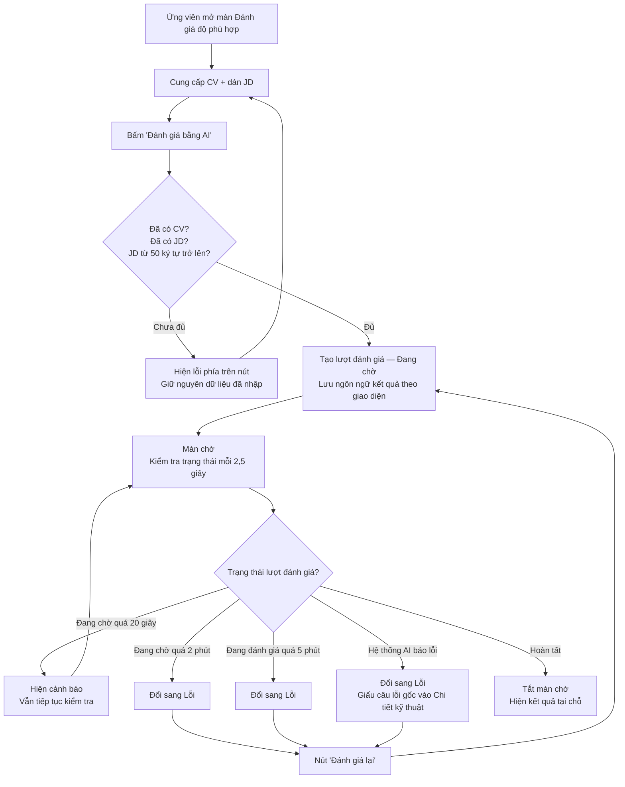
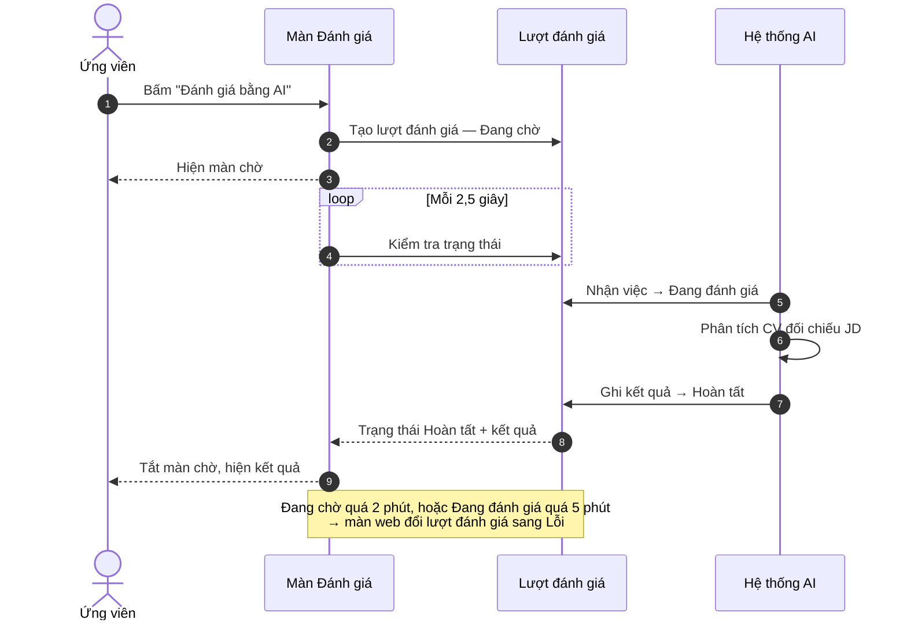

# US — Tiến trình Đánh giá độ phù hợp bằng AI

## 1. Lịch sử thay đổi

| **Version** | **Người tạo** | **Nội dung điều chỉnh** | **Ngày** |
| --- | --- | --- | --- |
| v1.0 | Nguyễn Thị Mỹ Phương | Tạo mới toàn bộ tài liệu | 16/08/2026 |

---

## 2. Link Jira

| **Mã US** | **Tiêu đề trên Jira** | **Link** |
| --- | --- | --- |
| AICV-17 | [Ứng viên] [Đánh giá độ phù hợp] Tiến trình Đánh giá độ phù hợp bằng AI | https://myphuongvlo2020.atlassian.net/browse/AICV-17 |

---

## 3. User Story

> *"Là ứng viên, tôi muốn AI đối chiếu CV của tôi với một tin tuyển dụng cụ thể, để có thể biết mình mạnh và yếu ở đâu so với vị trí đó thay vì phải đoán, và biết nên chuẩn bị những gì khi đi phỏng vấn."*

---

## 4. Workflow

| **Precondition** | Ứng viên đã đăng nhập và đang ở màn [Đánh giá độ phù hợp]. |
| --- | --- |
| **Basic Flow — Gửi một lượt đánh giá và nhận kết quả** | 1. Ứng viên mở màn [Đánh giá độ phù hợp]. 2. Hệ thống hiển thị: dải trạng thái [Hệ thống AI], thanh 3 bước, khối CV, khối JD, nút *"Đánh giá bằng AI"*. 3. Ứng viên cung cấp CV — chọn từ Thư viện CV hoặc tải tệp PDF lên. 4. Ứng viên dán nội dung JD vào ô JD. 5. Ứng viên bấm *"Đánh giá bằng AI"*. 6. Hệ thống kiểm tra: đã có nội dung CV, đã có nội dung JD, và JD dài từ 50 ký tự trở lên. 7. Hợp lệ → hệ thống tạo **lượt đánh giá** mới ở trạng thái **Đang chờ**, lưu kèm ngôn ngữ giao diện tại thời điểm này để làm ngôn ngữ của kết quả. 8. Hệ thống chuyển ứng viên sang màn kết quả của lượt đánh giá vừa tạo, và phủ lên đó một **màn chờ**. 9. Màn chờ tự kiểm tra trạng thái lượt đánh giá **2,5 giây một lần**. 10. [Hệ thống AI] nhận lượt đánh giá → trạng thái đổi sang **Đang đánh giá**. 11. [Hệ thống AI] phân tích xong và ghi kết quả → trạng thái đổi sang **Hoàn tất**. 12. Màn chờ tắt, kết quả hiện ra tại chỗ (không tải lại trang). |
| **Alternative Flow 1 — Thiếu CV hoặc thiếu JD** | Ở bước 6, ô CV hoặc ô JD trống → hệ thống **không tạo lượt đánh giá**, hiện lỗi ngay phía trên nút *"Đánh giá bằng AI"*. Ứng viên ở lại màn, mọi thứ đã nhập được giữ nguyên. |
| **Alternative Flow 2 — JD ngắn hơn 50 ký tự** | Ở bước 6, JD có nội dung nhưng dưới 50 ký tự → hệ thống **không tạo lượt đánh giá**, hiện lỗi ngay phía trên nút. Ứng viên ở lại màn, dữ liệu giữ nguyên. |
| **Alternative Flow 3 — Chờ quá 20 giây mà [Hệ thống AI] chưa nhận việc** | Lượt đánh giá vẫn ở **Đang chờ** sau 20 giây kể từ lúc mở màn chờ → màn chờ hiện thêm **một dòng cảnh báo**, đồng thời kiểm tra [Hệ thống AI] có đang hoạt động không để chọn đúng câu cảnh báo (xem mục 6.7). Màn chờ **vẫn tiếp tục kiểm tra trạng thái**, không dừng lại. |
| **Alternative Flow 4 — Lượt đánh giá kẹt ở Đang chờ quá 2 phút** | Lượt đánh giá ở **Đang chờ** liên tục 2 phút → hệ thống tự đổi nó sang **Lỗi**. Màn chờ tắt, hiện thông báo lỗi kèm nút *"Đánh giá lại"*. |
| **Alternative Flow 5 — Lượt đánh giá kẹt ở Đang đánh giá quá 5 phút** | Lượt đánh giá ở **Đang đánh giá** liên tục 5 phút → hệ thống tự đổi nó sang **Lỗi**. Màn chờ tắt, hiện thông báo lỗi kèm nút *"Đánh giá lại"*. |
| **Alternative Flow 6 — [Hệ thống AI] không xử lý được** | [Hệ thống AI] gặp sự cố và ghi lại lỗi → trạng thái thành **Lỗi**. Màn hiện một câu giải thích dễ hiểu; câu lỗi gốc của [Hệ thống AI] được **giấu trong mục "Chi tiết kỹ thuật"**, phải bấm mới xem. |
| **Alternative Flow 7 — Ứng viên bấm "Đánh giá lại"** | Ở trạng thái **Lỗi**, ứng viên bấm *"Đánh giá lại"* → hệ thống dùng lại **chính CV và JD của lượt đánh giá đó** (không bắt nhập lại), xoá kết quả và lỗi cũ, đưa trạng thái về **Đang chờ**, và cập nhật ngôn ngữ kết quả theo ngôn ngữ giao diện đang dùng. Màn chờ chạy lại từ đầu. **Không tạo lượt đánh giá mới** — vẫn là lượt cũ. |
| **Alternative Flow 8 — Mở một lượt đánh giá không đọc được** | Ứng viên mở màn kết quả của lượt đánh giá không thuộc tài khoản mình (thường do đang đăng nhập bằng tài khoản khác) → hiện màn trống kèm nút dẫn sang [Lịch sử đánh giá] (xem mục 6.6). |
| **Alternative Flow 9 — Ứng viên rời trang giữa lúc chờ** | Ứng viên đóng tab hoặc chuyển sang trang khác khi lượt đánh giá còn **Đang chờ** / **Đang đánh giá**: [Hệ thống AI] **vẫn tiếp tục xử lý và vẫn ghi kết quả**. Nhưng việc **tự đổi sang Lỗi khi quá hạn thì ngừng**, vì việc đó do màn web thực hiện. Lượt đánh giá giữ nguyên trạng thái cũ cho tới khi ứng viên mở lại một trong ba màn: màn kết quả của chính nó, [Tổng quan], hoặc [Lịch sử đánh giá] — lúc đó hệ thống mới rà và đổi các lượt quá hạn sang **Lỗi**. |
| **Alternative Flow 10 — Lượt đang Lỗi tự chuyển thành Hoàn tất** | [Hệ thống AI] hoàn thành **sau khi** lượt đánh giá đã bị đổi sang **Lỗi** do quá hạn → kết quả vẫn được ghi và trạng thái **bị ghi đè thành Hoàn tất**. Ứng viên thấy: lượt đang báo Lỗi, lát sau mở lại thì thành Hoàn tất kèm kết quả đầy đủ. Đây là hành vi **được chấp nhận**, không phải sự cố. |

### Sơ đồ luồng

### Sơ đồ BPMN

`docs/bpmn/tien-trinh-danh-gia-do-phu-hop.drawio`

### Sơ đồ tuần tự

---

## 5. Design

| **Màn hình** | **Mockup HTML** | **Ảnh chụp màn thực tế** |
| --- | --- | --- |
| Màn Đánh giá độ phù hợp | `mockup/cham-diem.html` | *(chưa gắn)* |
| Màn chờ | *(không có mockup riêng)* | *(chưa gắn)* |

---

## 6. Acceptance Criteria

### 6.1. Phạm vi thao tác

- **Màn hình hiển thị:** Web ứng viên → màn [Đánh giá độ phù hợp] và màn kết quả của một lượt đánh giá.
- **Đi tới bằng cách nào:** Chọn [Đánh giá độ phù hợp] trên thanh điều hướng bên trái. Màn kết quả không mở trực tiếp được — tới đó sau khi bấm *"Đánh giá bằng AI"*, hoặc khi mở một lượt đánh giá từ [Lịch sử đánh giá] / [Quản lý ứng tuyển].
- **Quyền xem:** Ứng viên đã đăng nhập. Mỗi ứng viên **chỉ đọc được lượt đánh giá do chính mình tạo**.
- **Chế độ tương tác:** Đọc-ghi. Ứng viên tạo lượt đánh giá mới, và tạo lại lượt đánh giá đã lỗi.
- **Nguồn dữ liệu:** CV do ứng viên chọn từ Thư viện CV hoặc tải lên. JD do ứng viên dán tay hoặc lấy về từ link tin tuyển dụng. Kết quả do [Hệ thống AI] sinh ra.
- **Không thuộc phạm vi US này:** Cách chọn/tải/xoá CV trong Thư viện CV · Dán link JD để lấy nội dung tự động · Nội dung chi tiết bên trong kết quả (điểm %, 6 nhóm tiêu chí, gợi ý) · Nút Lưu vào Quản lý ứng tuyển · Thử với Hồ sơ mẫu. Mỗi phần có US riêng.

### 6.2. Bảng mô tả trường thông tin

| **Trường thông tin** | **Giá trị / Mô tả và ràng buộc** |
| --- | --- |
| **Dải trạng thái [Hệ thống AI] — nằm dưới tiêu đề màn Đánh giá** | |
| Cách xác định trạng thái | • [Hệ thống AI] tự báo "còn sống" **10 giây một lần**. • Màn Đánh giá đọc mốc báo gần nhất. Cách thời điểm hiện tại **dưới 30 giây** → coi là **đang hoạt động**. **Từ 30 giây trở lên** → coi là **tạm ngưng**. • Chưa từng có mốc báo nào, hoặc không đọc được mốc báo → coi là **tạm ngưng**. • Màn đọc trạng thái ngay khi mở, sau đó đọc lại **15 giây một lần**. Rời màn thì ngừng đọc. |
| Khi chưa đọc xong lần đầu | • **Không hiển thị gì** ở vị trí này — không dòng, không thẻ, không ô chờ. |
| Khi **đang hoạt động** | • Hiện **một dòng chữ** kèm biểu tượng dấu tích: *"Hệ thống AI đang hoạt động — sẵn sàng đánh giá."* • Chỉ để thông báo. Không khoá, không đổi hành vi của bất kỳ nút nào trên màn. |
| Khi **tạm ngưng** | • Hiện **một thẻ cảnh báo** (không phải một dòng) gồm tiêu đề và mô tả. • Tiêu đề: *"Hệ thống AI đang tạm ngưng"*. • Mô tả: *"Bạn vẫn có thể gửi lượt đánh giá, nhưng kết quả chỉ có khi hệ thống hoạt động trở lại. Vui lòng thử lại sau ít phút."* • **Nút "Đánh giá bằng AI" vẫn bấm được bình thường.** Trạng thái này không chặn việc gửi. |
| Ba khả năng hiển thị ở trên | • **Loại trừ nhau** — tại một thời điểm chỉ hiện đúng một. |
| **Thanh 3 bước — cho ứng viên biết còn thiếu gì trước khi bấm nút** | |
| Bước 1 — *"Cung cấp CV"* | • Chữ mô tả dưới tiêu đề bước: *"Tải lên hoặc chọn CV từ thư viện"*. • Chuyển sang **Đã xong** khi ô CV đã có nội dung chữ **và** hệ thống đã đọc xong tệp. • Trong lúc hệ thống còn đang đọc tệp CV, bước này **chưa** tính là Đã xong. |
| Bước 2 — *"Dán JD"* | • Chữ mô tả: *"Dán mô tả công việc (JD)"*. • Chuyển sang **Đã xong** khi ô JD có từ **50 ký tự** trở lên. • Chỉ chuyển sang **Đang thực hiện** sau khi bước 1 đã xong. |
| Bước 3 — *"AI đánh giá và trả kết quả"* | • Chữ mô tả: *"AI phân tích độ phù hợp & trả kết quả"*. • Chuyển sang **Đang thực hiện** kể từ lúc ứng viên bấm nút và hệ thống bắt đầu tạo lượt đánh giá. • Bước này **không bao giờ** chuyển sang Đã xong trên màn này, vì màn đã chuyển sang màn kết quả trước đó. |
| Nhãn trạng thái của mỗi bước | • Đúng ba giá trị: *"Đã xong"* · *"Đang thực hiện"* · *"Chưa bắt đầu"*. |
| **Khối JD** | |
| Ô nhập JD | • Ô nhập nhiều dòng. Chữ gợi ý khi trống: *"Dán mô tả công việc (JD) vào đây…"*. • **Bắt buộc.** Phải có từ **50 ký tự** trở lên mới gửi được. • **Không giới hạn độ dài tối đa.** CV cũng vậy. |
| Bộ đếm ký tự | • Nằm ở góc phải tiêu đề khối, hiện dạng *"{số} ký tự"*. • Cập nhật ngay theo từng ký tự ứng viên gõ hoặc dán vào. |
| Nút xoá nội dung JD | • Biểu tượng thùng rác ở góc phải tiêu đề khối, chú thích khi rê chuột: *"Xóa nội dung JD"*. • Bấm vào: xoá **cả nội dung JD lẫn link tin tuyển dụng** đã dán trước đó. |
| **Nút gửi** | |
| Nút *"Đánh giá bằng AI"* | • Trong lúc hệ thống đang tạo lượt đánh giá, nhãn đổi thành *"Đang tạo…"*. • **Bị khoá** trong 4 trường hợp: hệ thống đang đọc chữ từ tệp PDF · đang lưu CV vào Thư viện CV · đang tạo lượt đánh giá · đang đọc nội dung CV vừa chọn. • **Không bị khoá** khi [Hệ thống AI] tạm ngưng, khi ô CV trống, hay khi ô JD trống — bấm vào thì hiện lỗi ở mục 6.7. |
| **Màn chờ — phủ toàn màn hình, che cả thanh điều hướng** | |
| Tiêu đề màn chờ | • *"AI đang phân tích CV của bạn"*. Không đổi trong suốt thời gian chờ. |
| Dòng phụ khi trạng thái là **Đang chờ** | • *"Đang nhận CV…"*. |
| Dòng phụ khi trạng thái là **Đang đánh giá** | • Dạng *"{câu mô tả} · đã chờ {số giây}s"*. • Số giây đếm từ lúc mở màn chờ, tăng mỗi giây. • {câu mô tả} đổi **4 giây một lần** theo thứ tự: *"Đang đọc cấu trúc CV…"* → *"Phân tích 6 nhóm tiêu chí cốt lõi…"* → *"Xét mức phù hợp với từng yêu cầu trong JD…"* → *"Tổng hợp báo cáo độ phù hợp…"*. Tới câu thứ tư thì giữ nguyên câu đó tới hết. |
| Danh sách 4 bước trên màn chờ | • Bốn dòng cố định: *"Đọc và thấu hiểu CV của bạn"* · *"Nghiên cứu kỳ vọng từ Nhà tuyển dụng"* · *"Phân tích điểm tương thích"* · *"Chuẩn bị "bí kíp" giúp bạn ghi điểm"*. • Khi trạng thái là **Đang chờ**: luôn sáng ở dòng 1. • Khi trạng thái là **Đang đánh giá**: sáng dòng tiếp theo sau **mỗi 5 giây**, tới dòng 4 thì dừng ở đó. • Dòng nào đã qua thì hiện dạng đã hoàn thành, dòng chưa tới thì hiện mờ. |
| **Trạng thái Lỗi** | |
| Nút *"Đánh giá lại"* | • Trong lúc đang chạy, nhãn đổi thành *"Đang tạo lại…"* và nút bị khoá. • Chữ chú thích cạnh nút: *"Tạo lại lượt đánh giá từ chính CV và JD cũ (không cần nhập lại)."* |
| Mục *"Chi tiết kỹ thuật"* | • **Chỉ hiện khi** lỗi do [Hệ thống AI] ghi (không hiện khi lỗi do quá hạn). • Mặc định thu gọn, bấm mới mở ra; bên trong là câu lỗi gốc. |

### 6.3. Ràng buộc nghiệp vụ chung

**Do người dùng thao tác:**

- **JD phải có từ 50 ký tự trở lên** — dưới ngưỡng thì không tạo lượt đánh giá. *Lý do: vài chữ không đủ để AI hiểu yêu cầu công việc, kết quả sẽ vô nghĩa; đồng thời chặn việc gửi bừa gây tốn lượt gọi AI.*
- **[Hệ thống AI] tạm ngưng vẫn gửi được lượt đánh giá** — lượt đánh giá nằm ở **Đang chờ** cho tới khi [Hệ thống AI] hoạt động lại. *Lý do: ứng viên không phải ngồi canh xem hệ thống bật chưa; gửi xong đi làm việc khác, quay lại có kết quả.*
- **"Đánh giá lại" dùng lại CV và JD của chính lượt đánh giá đó** — không bắt nhập lại, không tạo lượt mới. *Lý do: lỗi phát sinh từ phía hệ thống, bắt ứng viên nhập lại từ đầu là phạt nhầm người.*
- **"Đánh giá lại" cập nhật ngôn ngữ kết quả theo giao diện đang dùng** — đang xem giao diện tiếng Anh mà bấm Đánh giá lại thì kết quả mới ra tiếng Anh. *Lý do: đây là cách duy nhất để xem lại một lượt đánh giá cũ bằng ngôn ngữ khác.*

**Do hệ thống tự xử lý:**

> Các cơ chế dưới đây chạy ngầm, không do ứng viên bấm gì, nhưng làm thay đổi trạng thái của chính lượt đánh giá mà màn này đang hiển thị, nên đặc tả tại đây.

- **Ngôn ngữ của kết quả cố định tại thời điểm tạo lượt đánh giá.** Đổi ngôn ngữ giao diện sau đó **không** dịch lại kết quả cũ. *Lý do: kết quả do AI sinh ra, dịch lại đồng nghĩa gọi AI thêm một lần — tốn chi phí và có thể ra chữ khác với bản đã xem.*
- **Cảnh báo sau 20 giây nếu lượt đánh giá vẫn ở Đang chờ.** *Lý do: bình thường [Hệ thống AI] nhận việc trong vài giây; quá 20 giây gần như chắc chắn nó không chạy — báo sớm còn hơn để ứng viên nhìn màn hình chờ mà không biết chuyện gì.*
- **Tự đổi sang Lỗi khi quá hạn:** ở **Đang chờ** quá **2 phút**, hoặc ở **Đang đánh giá** quá **5 phút**. *Lý do: [Hệ thống AI] chạy trên một máy có thể tắt bất cứ lúc nào, và khi tắt thì không còn ai ghi lỗi hộ; không có cơ chế này thì lượt đánh giá treo mãi mãi.*
- **Thời gian quá hạn đếm từ lần đổi trạng thái gần nhất**, không đếm từ lúc tạo lượt đánh giá. *Lý do: nếu đếm từ lúc tạo, ứng viên bấm "Đánh giá lại" một lượt cũ sẽ bị coi là quá hạn ngay lập tức.*
- **Việc canh quá hạn do màn web thực hiện, không phải [Hệ thống AI] thực hiện.** Nó chỉ chạy khi có người đang mở màn kết quả, [Tổng quan] hoặc [Lịch sử đánh giá]. Không ai mở màn nào thì không có gì canh: lượt đánh giá bị bỏ dở nằm nguyên ở **Đang chờ** / **Đang đánh giá** cho tới lần kế tiếp có người mở một trong ba màn đó. *Lý do: đây là hạn chế đã biết và chấp nhận, đổi lại việc không phải dựng thêm một tiến trình nền chỉ để canh — sẽ tính lại khi [Hệ thống AI] chuyển sang chạy ở môi trường ổn định.*
- **Trạng thái Lỗi do quá hạn không cho biết [Hệ thống AI] đã chạy hay chưa.** Màn web đánh dấu Lỗi dựa trên **đồng hồ**, còn chi phí AI được ghi lại dựa trên **việc AI có thật sự chạy hay không**. Vì vậy một lượt đánh giá hiện **Lỗi** vẫn có thể đã phát sinh chi phí. *Lý do: [Hệ thống AI] không biết màn web vừa đánh dấu lượt đó là Lỗi. Muốn biết một lượt có tốn chi phí không thì tra ở màn [Chi phí AI], không kết luận từ trạng thái trên màn kết quả.*
- **[Hệ thống AI] hoàn thành sau khi lượt đánh giá đã bị đánh dấu Lỗi thì kết quả vẫn được ghi**, và trạng thái bị ghi đè thành **Hoàn tất**. *Lý do: kết quả đã có thật thì không vứt đi; thà để ứng viên nhận kết quả muộn còn hơn mất trắng. Đánh đổi: trạng thái có thể nhảy ngược từ Lỗi về Hoàn tất.*
- **Hiệu ứng chúc mừng chỉ chạy một lần cho mỗi tài khoản**, ở lượt đánh giá **Hoàn tất** đầu tiên. *Lý do: ăn mừng lần đầu là vui, lần nào cũng chạy thì thành phiền.*

### 6.4. Ví dụ minh hoạ

**Bối cảnh 1 — [Hệ thống AI] đang tắt.** Ứng viên bấm *"Đánh giá bằng AI"* lúc 10:00:00.

| Thời điểm | Hệ thống làm gì | Ứng viên thấy gì |
| --- | --- | --- |
| 10:00:00 | Tạo lượt đánh giá ở **Đang chờ**, mở màn chờ | Màn chờ, dòng phụ *"Đang nhận CV…"*, sáng ở dòng 1 |
| 10:00:20 | Vẫn **Đang chờ** → kiểm tra [Hệ thống AI], thấy đang tạm ngưng | Thêm dòng cảnh báo *"Hệ thống AI đang tạm ngưng…"*. Màn chờ vẫn chạy |
| 10:00:20 → 10:02:00 | Tiếp tục kiểm tra trạng thái mỗi 2,5 giây | Không đổi gì |
| 10:02:00 | Tròn 2 phút ở **Đang chờ** → đổi sang **Lỗi** | Màn chờ tắt. Hiện *"Hệ thống AI hiện chưa sẵn sàng…"* + nút *"Đánh giá lại"* |
| Sau khi bật lại [Hệ thống AI], ứng viên bấm *"Đánh giá lại"* | Trạng thái về **Đang chờ**, đồng hồ quá hạn đếm lại từ 0 | Màn chờ chạy lại từ đầu |

**Bối cảnh 2 — ứng viên đóng tab giữa chừng.** Bấm *"Đánh giá bằng AI"* lúc 09:00:00, đóng tab lúc 09:00:30 khi lượt đánh giá đang ở **Đang đánh giá**.

| Thời điểm | Hệ thống làm gì |
| --- | --- |
| 09:00:30 | Tab đóng → việc canh quá hạn **ngừng hoạt động**. [Hệ thống AI] **vẫn chạy tiếp** |
| Nếu [Hệ thống AI] xong lúc 09:01:10 | Ghi kết quả, trạng thái thành **Hoàn tất**. Ứng viên mở lại lúc nào cũng thấy kết quả |
| Nếu [Hệ thống AI] chết lúc 09:00:45 | **Không ai** đổi lượt này sang Lỗi. Nó nằm ở **Đang đánh giá** suốt các ngày sau |
| 14:00 hôm sau, ứng viên mở [Lịch sử đánh giá] | Hệ thống rà, thấy đã quá 5 phút → **lúc này** mới đổi sang **Lỗi** |
| Về chi phí | Dù màn hình báo **Lỗi**, [Hệ thống AI] đã chạy một phần nên **vẫn có thể đã tốn chi phí**. Tra ở màn [Chi phí AI] mới biết chắc |

### 6.5. Hành vi khi thành công

1. Màn chờ tắt, kết quả hiện ngay trên cùng màn đó — **không tải lại trang, không chuyển sang màn khác**.
2. Tiêu đề màn đổi thành *"Xong rồi — đây là độ phù hợp của bạn với công việc"*.
3. Nếu đây là lượt đánh giá **Hoàn tất** đầu tiên của tài khoản: chạy hiệu ứng chúc mừng một lần.
4. Lượt đánh giá xuất hiện trong [Lịch sử đánh giá].

### 6.6. Trạng thái rỗng (Empty state)

| **Trường hợp** | **Hiển thị** |
| --- | --- |
| Mở màn kết quả của một lượt đánh giá không đọc được (thường do đang đăng nhập bằng tài khoản khác) | • Tiêu đề: *"Không tìm thấy lượt đánh giá này"*. • Mô tả: *"Lượt đánh giá không tồn tại, hoặc nó thuộc một tài khoản khác. Nếu bạn vừa đổi tài khoản, hãy đăng nhập lại bằng tài khoản đã tạo lượt đánh giá đó."* • Nút: *"Xem Lịch sử đánh giá"* → mở màn [Lịch sử đánh giá]. |
| Thư viện CV chưa có CV nào | • Ở khối CV hiện dòng: *"Chưa có CV nào lưu. Sang tab "Tải PDF" để thêm CV đầu tiên."* |

### 6.7. Thông báo lỗi

| **Trường hợp** | **Thông báo** |
| --- | --- |
| Bấm nút khi ô CV hoặc ô JD trống | *"Cần có cả CV và JD."* |
| Bấm nút khi JD dưới 50 ký tự | *"Mô tả công việc (JD) quá ngắn — hãy dán JD đầy đủ (ít nhất 50 ký tự) để đánh giá chính xác."* |
| Phiên đăng nhập đã hết khi bấm nút | *"Chưa đăng nhập."* |
| Không tạo được lượt đánh giá | *"Không tạo được lượt đánh giá."* |
| Chờ quá 20 giây, [Hệ thống AI] đang hoạt động | *"Hệ thống AI đang khởi động nên kết quả có thể lâu hơn thường lệ một chút. Bạn cứ giữ trang này — kết quả sẽ tự hiện ngay khi sẵn sàng."* |
| Chờ quá 20 giây, [Hệ thống AI] đang tạm ngưng | *"Hệ thống AI đang tạm ngưng nên lượt đánh giá chưa thể chạy. Bạn có thể chờ thêm, hoặc quay lại thử "↻ Đánh giá lại" sau ít phút."* |
| Quá hạn ở **Đang chờ** (2 phút) | *"Hệ thống AI hiện chưa sẵn sàng nên chưa thể đánh giá. Vui lòng thử lại sau ít phút bằng nút "↻ Đánh giá lại"."* |
| Quá hạn ở **Đang đánh giá** (5 phút) | *"Lượt đánh giá bị gián đoạn. Vui lòng bấm "↻ Đánh giá lại"."* |
| [Hệ thống AI] không xử lý được | *"Hệ thống AI chưa xử lý được lượt đánh giá này. Bạn bấm "↻ Đánh giá lại" nhé — nếu vẫn chưa được, thử lại sau ít phút."* — kèm mục *"Chi tiết kỹ thuật"* thu gọn |
| Bấm "Đánh giá lại" nhưng không tạo lại được | *"Không tạo lại được lượt đánh giá."* |

**Nơi hiển thị lỗi:**

- Lỗi ở bước bấm nút (4 dòng đầu): hiện **ngay phía trên nút "Đánh giá bằng AI"**. Không rời màn, không xoá dữ liệu đã nhập.
- Lỗi cảnh báo khi chờ (2 dòng giữa): hiện **bên trong màn chờ**, phía dưới danh sách 4 bước. Màn chờ **không tắt**.
- Lỗi trạng thái (3 dòng cuối): hiện ở **màn kết quả**, thay cho chỗ đáng lẽ là kết quả, kèm nút *"Đánh giá lại"*.
